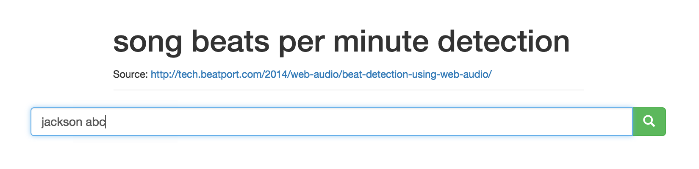
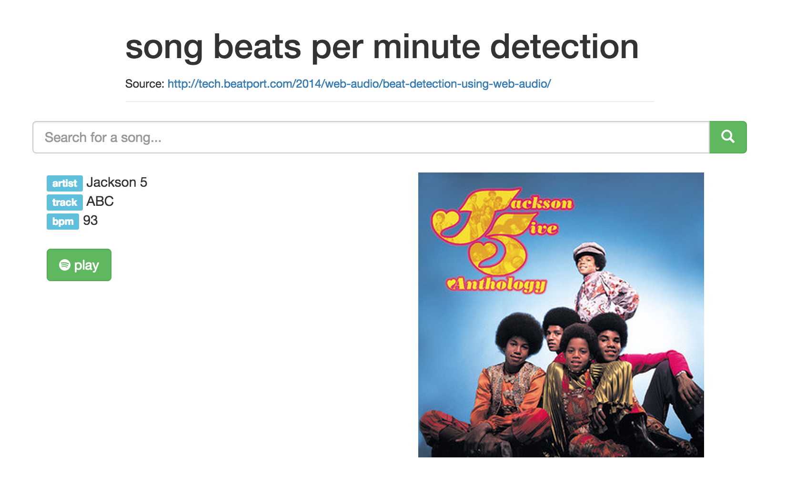

### song beats per minute detection

This small project for detecting the beats per minute of a song is based on the algorithm described [here](http://tech.beatport.com/2014/web-audio/beat-detection-using-web-audio/), using the WebAudio API. We also use the Spotify API to get the 30-second song preview clips.

There is also a `Procfile` for easy [heroku](https://dashboard.heroku.com/) deployment.

#### Demo

* query

* result

#### Remarks
Due to the usage of the WebAudio API the beat detection (audio processing) seems not to be working under Safari. If you want to be on the safe side try opening it in Chrome.
